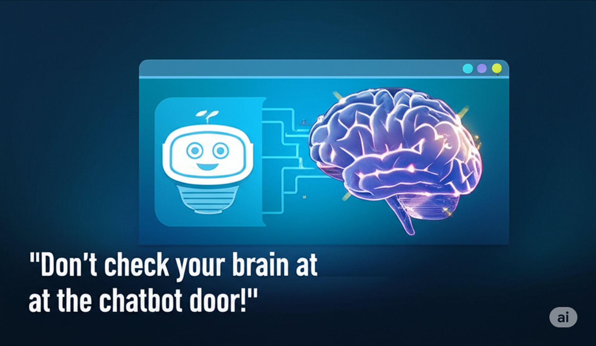

Here are my recent reposts mentioned above: 
• 1. ["Don't check your brain at the chatbot door!"](https://www.linkedin.com/posts/activity-7347349098309525504-cyDQ/) 

• 2. ["Use it or lose it!" — Another helpful reminder to use AI to supplement rather than to supplant your thinking](https://www.linkedin.com/posts/activity-7356500246824148994-Tgbn/) 
• 3. [Before your best and brightest employees leave your employ, through retirement or otherwise, start "mining" their minds for "nuggets of knowledge" you'll want to "cash in on".](https://www.linkedin.com/posts/activity-7356503894585233409-n5-A/) v