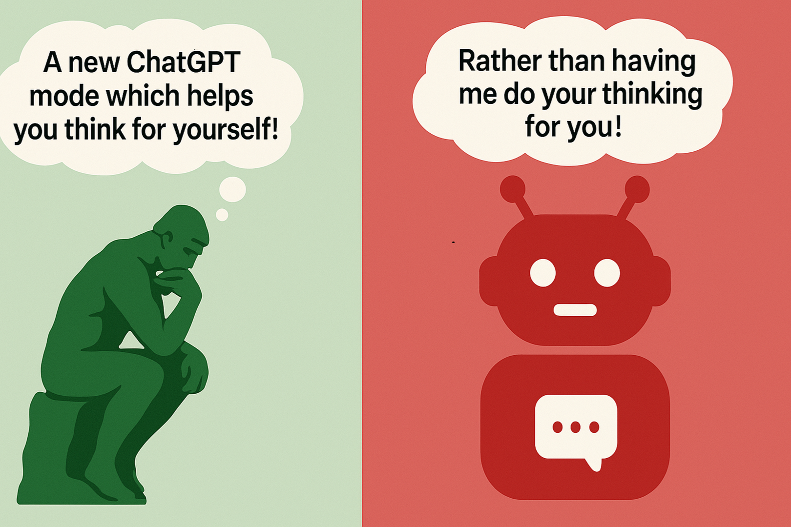

ChatGPT 'study mode': A new ChatGPT mode which helps you think for yourself! 🤔 Rather than having ChatGPT do your thinking for you! 🧠🚫

I've recently reposted content **critical** of the use of ChatGPT in a way which impairs your ability to think **critically**.

Last night, I found out that ChatGPT now has its own **answer** to that problem.

Yesterday's episode (Episode 4: How AI is tranforming education) of the [OpenAI Podcast](https://openai.com/podcast/) included a [discussion of ChatGPT's new "Study Mode"](https://www.youtube.com/watch?v=QCLkJra0PjY&t=410s). Study Mode is designed "not just to give you answers, but to help you learn". 

For more information, see OpenAI's brief (1:03), deliberately silent [Introducing ChatGPT Study Mode](https://www.youtube.com/watch?app=desktop&v=XDYilxy1dn8) YouTube video. Or their [Introducing study mode](https://openai.com/index/chatgpt-study-mode/) article.

***

Credits: I wrote this post and came up with the image idea myself. But I used ChatGPT to generate the image.